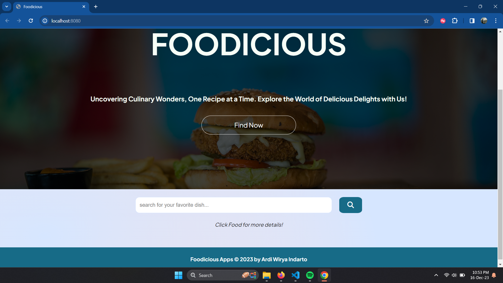

# Foodicious

Submission: Membuat Aplikasi Web dengan ES6, Custom Element, NPM, Module Bundler, dan AJAX.

**Foodicious** _(Food Catalog)_ - Aplikasi katalog resep makanan untuk lulus dari kelas [Belajar Fundamental Front-End Web Development](https://www.dicoding.com/academies/163).
Rating submission Bintang 4⭐.

## Tampilan Website

## Kriteria utama Foodicious:

1. Menggunakan standar _EcmaScript6_ dalam menuliskan kode JavaScript.
2. Terdapat minimal satu penerapan _custom element_.
3. Menggunakan Webpack sebagai module bundler (tahap production).
4. Memanfaatkan Webpack sebagai environment dalam pengembangan proyek (tahap development).
5. Memanfaatkan API dengan menggunakan konsep AJAX dalam menampilkan data yang dinamis pada aplikasi yang dibuat.

Public API yang dimanfaatkan dalam pengerjaan submission: [TheMealDB](https://www.themealdb.com/api.php)

## Scripts Menjalankan Aplikasi

1. Install semua package yang dibutuhkan

   `npm install`

2. Build Aplikasi

   `npm run build`

3. Jalankan aplikasi pada server

   `npm run start-dev`
