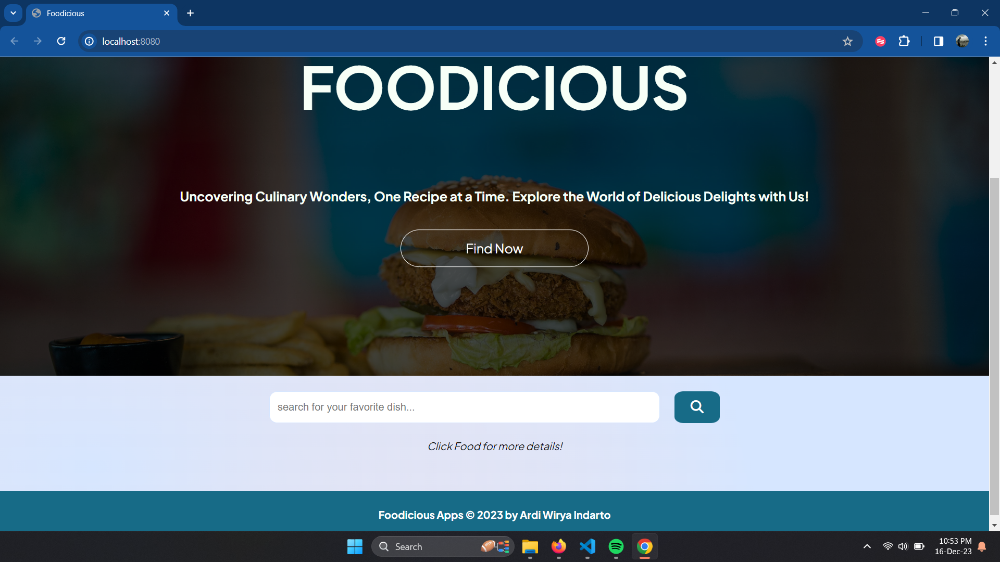

# Foodicious

Aplikasi katalog resep makanan (*food catalog*), dibuat sebagai submission kelas [Belajar Fundamental Front-End Web Development](https://www.dicoding.com/academies/163) — Dicoding. Submission ini mendapat rating **4/5**.

**Demo:** [Foodicious](https://foodicious.netlify.app/)

## Preview



## Fokus Teknis

Proyek ini merupakan latihan membangun aplikasi front-end modern dengan tooling standar industri, mencakup:

- **JavaScript ES6** — seluruh kode ditulis menggunakan sintaks modern (arrow function, class, destructuring, module, dsb).
- **Custom Element** — komponen UI dibangun dengan Web Components agar bersifat *reusable* dan *encapsulated*.
- **Module Bundler (Webpack)** — digunakan baik pada tahap development (dengan dev server) maupun production (build ke berkas statis siap rilis).
- **AJAX / Fetch API** — data resep diambil secara dinamis dari public API, bukan data statis yang di-hardcode.

## Sumber Data

Menggunakan public API [TheMealDB](https://www.themealdb.com/api.php) untuk menampilkan data resep, bahan, dan detail makanan secara real-time.

## Struktur Proyek

```
foodicious/
├── src/
│   ├── assets/
│   │   ├── style.css
│   │   ├── bg.jpg
│   │   └── Screenshot.png
│   ├── scripts/
│   │   ├── components/        # Custom element (Web Components)
│   │   │   ├── app-header.js
│   │   │   ├── footer-bar.js
│   │   │   ├── meal-item.js
│   │   │   └── search-bar.js
│   │   ├── data/
│   │   │   └── data-source.js # Layer pengambilan data dari TheMealDB API
│   │   ├── view/
│   │   │   └── main.js        # Logic utama render halaman
│   │   └── index.js           # Entry point aplikasi
│   └── index.html
├── dist/                      # Hasil build production (Webpack)
├── webpack.common.js
├── webpack.dev.js
├── webpack.prod.js
└── package.json
```

Setiap elemen UI (header, footer, search bar, kartu resep) dibangun sebagai custom element terpisah di `scripts/components/`, sementara pengambilan data dari API dipisahkan ke `scripts/data/data-source.js` agar logic fetching tidak bercampur dengan logic tampilan.

## Instalasi & Menjalankan Proyek

1. Install dependencies

   ```bash
   npm install
   ```

2. Jalankan pada mode development

   ```bash
   npm run start-dev
   ```

3. Build untuk production

   ```bash
   npm run build
   ```

## Catatan

Karena seluruh data resep bergantung pada TheMealDB API, aplikasi memerlukan koneksi internet aktif agar dapat menampilkan konten dengan benar.
